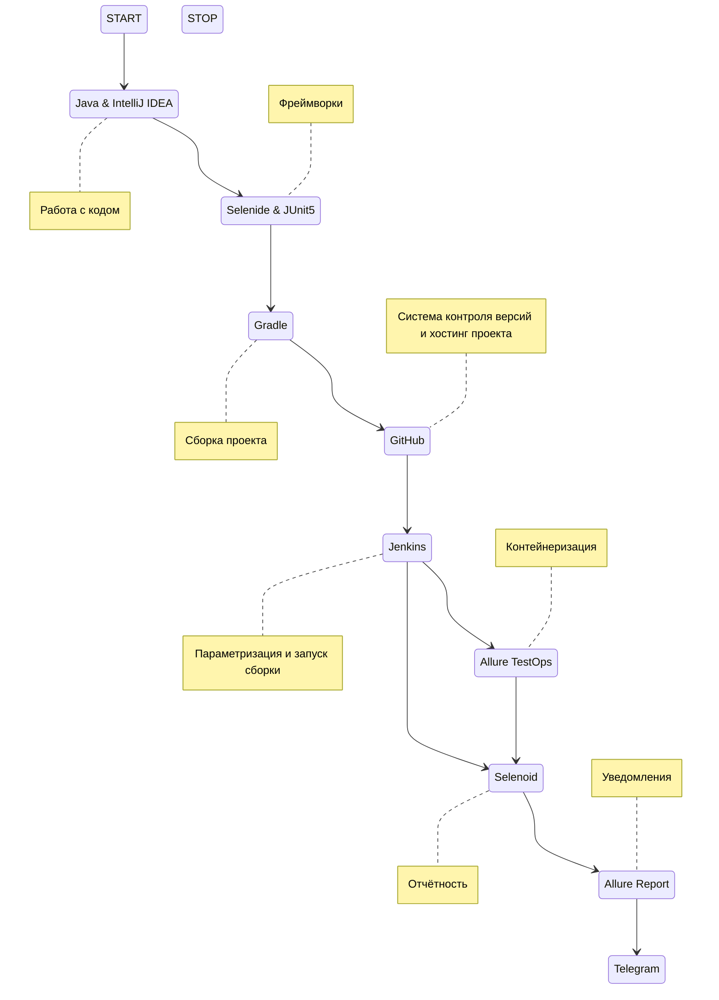

# Automated testing of the site "Applied Technologies"

## :page_with_curl:         Content

➠ [Covered functionality](#globe_with_meridians-covered-functionality)

➠ [Technology stack](#computer-technology-stack)

➠ [Running tests from the terminal](#technologist-running-tests-from-the-terminal)

➠ [Remote Test Run](#удаленный-Remote-Test-Run)

➠ [Build in Jenkins](#-Главная-Build-in-Jenkins)

➠ [Test results report in Allure Report](#-Test-results-report-in-allure-report)

➠ [Test results report in Allure Report](#-Test-results-report-in-allure-report)

➠ [Уведомления в Telegram с использованием бота](#-уведомления-в-telegram-с-использованием-бота)

➠ [An example of running a test in Selenoid](#-An-example-of-running-a-test-in-Selenoid)
## <a name="globe_with_meridians-covered-functionality"></a>:globe_with_meridians: Covered functionality

### UI

- [x] Проверка открытия страницы по тексту в заголовке
- [x] Проверка на ошибки в консоль логах страницы
- [x] Проверка перехода на страницу партнеров
- [x] Проверка на смену языка
- [x] Проверка перехода на страницу отзывов через выпадающий список

## :computer: Технологический стек

<p align="center">


</p>


## :technologist: Запуск тестов из терминала

### Локальный запуск тестов

```
gradle clean test
```

### Удаленный запуск тестов

```
clean test
-Dbrowser=${BROWSER}
-DbrowserVersion=${BROWSER_VERSION}
-DbrowserSize=${BROWSER_SIZE}
-DremoteDriverUrl=https://${REMOTE_DRIVER_URL}/wd/hub/
-DvideoStorage=https://${REMOTE_DRIVER_URL}/video/
-Dthreads=${THREADS}
```

### Параметры сборки

> <code>BROWSER</code> – браузер, в котором будут выполняться тесты (_по умолчанию - <code>chrome</code>_).
>
> <code>BROWSER_SIZE</code> – размер окна браузера, в котором будут выполняться тесты (_по умолчанию - <code>1920x1080</code>_).
>
> <code>BROWSER_VERSION</code> – версия браузера (_по умолчанию - <code>99</code>_).
>
> <code>REMOTE_DRIVER_URL</code> – url селеноида.
>
> <code>THREADS</code> – кол-во потоков для параллельного запуска.
>


##  Главная страница сборки Jenkins

<p align="center">
  
</p>

##  Отчет о результатах тестирования в Allure Report

### :pushpin: Главная страница Allure-отчета

<p align="center">

</p>

### :pushpin: Страница с тестами


<p align="center">

</p>

### :pushpin: Основной дашборд

<p align="center">

</p>

##  Уведомления в Telegram с использованием бота

> После завершения сборки бот, созданный в <code>Telegram</code>, автоматически обрабатывает и отправляет сообщение с отчетом.
<p align="center">

</p>

##  Пример запуска теста в Selenoid

> К каждому тесту в отчете прилагается видео. Одно из таких видео представлено ниже. Тест кейс на проверку перехода на страницу отзывов через выпадающий список
<p align="center">
  
</p>

:blue_heart: <a target="_blank" href="https://t.me/YuriyMqa">t.me/dmitrishin13</a>