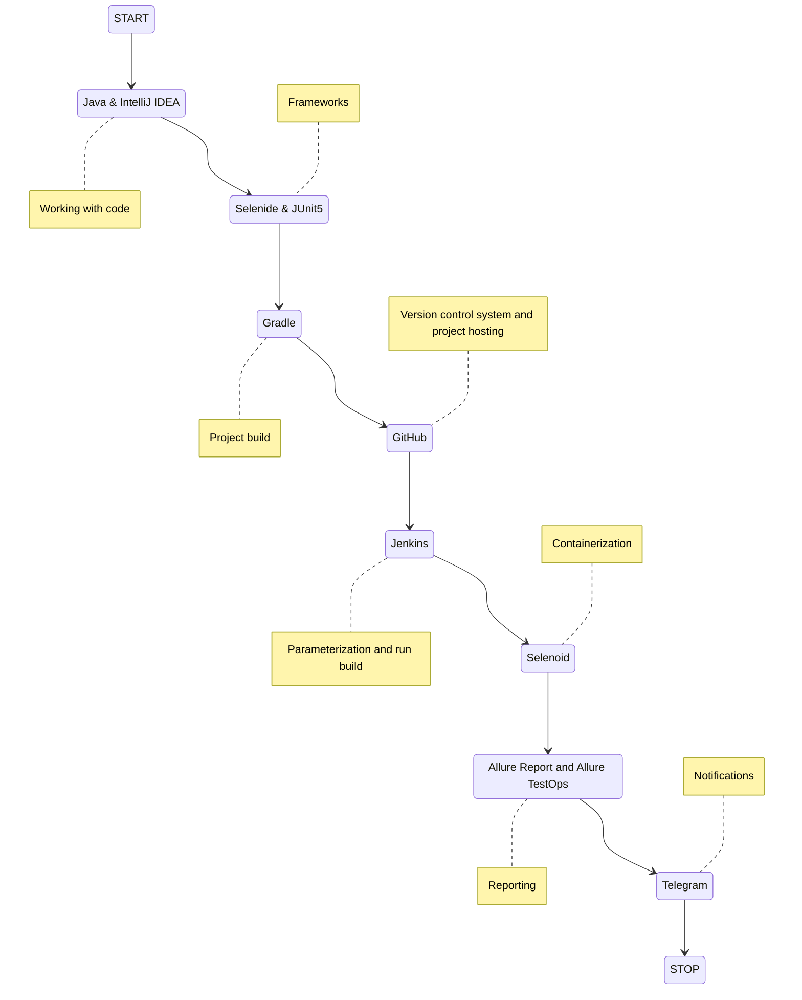

# Automated testing of the site "Applied Technologies"

## :page_with_curl:         Content

➠ [Covered functionality](#globe_with_meridians-covered-functionality)

➠ [Technology stack](#computer-technology-stack)

➠ [Running tests from the terminal](#technologist-running-tests-from-the-terminal)

➠ [Remote Test Run](#удаленный-Remote-Test-Run)

➠ [Build in Jenkins](#-Главная-Build-in-Jenkins)

➠ [Test results report in Allure Report](#-Test-results-report-in-allure-report)

➠ [Test results report in Allure TestOps](#-Test-results-report-in-allure-TestOps)

➠ [Telegram notifications using a bot](#-Telegram-notifications-using-a-bot)

➠ [An example of running a test in Selenoid](#-An-example-of-running-a-test-in-Selenoid)
## <a name="globe_with_meridians-covered-functionality"></a>:globe_with_meridians: Covered functionality

### UI

- [x] Open main page when press on title
- [x] Page console log should not have errors
- [x] Check content of Partners Page
- [x] Change Language to English
- [x] Open Feedback page from drop-down list 'About company'
- [x] Send request to company
- [x] Check content of Project Page
- [x] Check content of Career Page

## :computer:  Technology stack

<p align="center">


</p>



## :technologist: Running tests from the terminal

### Local test run:

```
gradle clean test
```

### Remote test run:

```
clean
test
 -Dbrowser=${BROWSER}
 -DbrowserSize=${BROWSER_SIZE}
```

### Build Options

> <code>BROWSER</code> – the browser in which the tests will be run (_default - <code>chrome</code>_).
>
> <code>BROWSER_SIZE</code> – size of the browser window in which tests will be executed (_default - <code>1920x1080</code>_).
>


##  Jenkins Build Main Page

<p align="center">
  
</p>

##  Test results report in Allure Report

### :pushpin: Main page of the Allure report

<p align="center">

</p>

### :pushpin: Page with tests


<p align="center">

</p>

### :pushpin: Window with charts

<p align="center">

</p>


##  Integration with AllureTestOps

### :pushpin: Test cases with launch history

<p align="center">

</p>

### :pushpin: Dashboard


<p align="center">

</p>


##  Telegram notifications using a bot

> After the build is completed, the bot created in <code>Telegram</code> automatically processes and sends a message with a report.
<p align="center">

</p>

##  An example of running a test in Selenoid

> A video is attached to each test in the report. One of these videos is shown below. Test case for checking the sending of an application to the company
<p align="center">
  
</p>

:blue_heart: <a target="_blank" href="https://t.me/YuriyMqa">t.me/dmitrishin13</a>